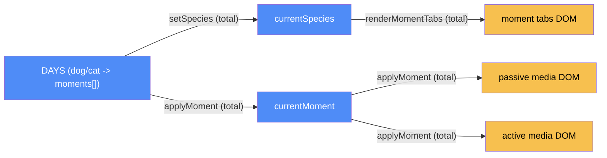

# Compare plans — categorical model

> Model-first (FRAMEWORK §2/§4). Intended specification for this component; the
> code realises it (see IMPLEMENTATION.md). Source of record: `compare.html`.
>
> **Uncommitted at scaffold time** (2026-09-23) — this page exists on disk but
> is not yet in git. The code is complete and wired (confirmed by reading
> `compare.html`), so this is modeled as built, not planned — but re-check
> `git status` before treating it as finished if picking this up later.

## 1. Overview
A separate "passive camera vs. active NuzzlePal" comparison page: a species
toggle (dog/cat) and a timeline of four "moments" per species, each showing a
before/after pair (a static passive-camera view vs. what NuzzlePal actually
does).

## 2. Why
Modeling this as its own component, not folded into `content` or
`plans-wheel`, because it's a **separate document** (`compare.html`, not
`index.html`) — a real code-root boundary, not just a UI seam.

## 3. Core category

## 4. Morphism table
| Morphism | Signature | Partiality | Semantics |
| --- | --- | --- | --- |
| `setSpecies` | `species:'dog'\|'cat' → DOM` | Total | resets `currentMoment` to 0, re-renders tabs + moment 0 |
| `renderMomentTabs` | `() → DOM` | Total | reads `DAYS[currentSpecies].moments` |
| `applyMoment` | `index:number → DOM` | Total | swaps passive/active media (image or video per `moment.kind`), captions, logs; 180ms transition |
| `initSpeciesSwitch` | `() → DOM listener` | Total | |
| `initPlanButtons` | `() → DOM listener` | Total | both buttons only `showToast` — no real signup |
| `initFaq` | `() → DOM listener` | Total | accordion, closes siblings on open |

## 5. Functors
**Species-switch pipeline**: `click → setSpecies → (renderMomentTabs,
applyMoment(0)) → DOM`. **Moment-switch pipeline**: `click → applyMoment →
DOM` (image or video branch per `moment.kind`).

## 6. Composition rules
1. `invariant: currentMoment resets to 0 on every species switch` — enforced
   in `setSpecies`.
2. `constraint: moment.kind ∈ {'img','video'}` — `applyMoment` branches on
   this to show/hide `#activeImg`/`#activeVideo`; no other kind is handled.

## 7. Atoms owned (FRAMEWORK §4)
**Trn** — the morphism table above; realising code `compare.html:<script>`.
**Loc** — one: the browser tab (same kind as `index.html`'s, a separate page load).
**Trm** — none.
**Placements (§4.2)** — none.

## 8. Bridges to other components (ports)
| Boundary morphism | Signature | Stored? | Semantics |
| --- | --- | --- | --- |
| none declared | `compare-plans ↔ index.html components` | — | `compare.html` duplicates `el`/`showToast`/`initHeader` rather than sharing them — see `docs/IMPLEMENTATION.md` "Divergences" |

Pricing overlap with `index.html:PET_PLANS` is tracked as a system-wide
suggestion, not a port — see `docs/suggestions.md` #2.

## 9. Coherence notes
No §4.5 law FAILing. Worth re-checking git status before further work — this
component was uncommitted when scaffolded.
