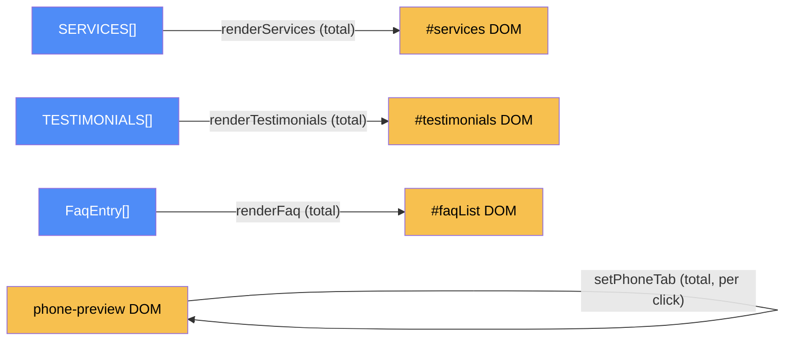

# Content — categorical model

> Model-first (FRAMEWORK §2/§4). Intended specification for this component; the
> code realises it (see IMPLEMENTATION.md). Source of record: `index.html`.

## 1. Overview
The site's static content sections — services, testimonials, FAQ, the phone
app-preview tabs — plus the shared bootstrap and utility functions every other
`index.html` component calls (`el`, `showToast`, `initHeader`, `initHeroVideo`,
`init`).

## 2. Why
This is the "everything that isn't a distinct interactive feature" bucket, and
also the de facto shared-utility owner. Modeling it separately from
`plans-wheel`/`roaming-mascots`/`device-panel` makes the cross-component
utility calls (§4.5 Law 4) visible instead of buried inside four features that
each look self-contained.

## 3. Core category

## 4. Morphism table
| Morphism | Signature | Partiality | Semantics |
| --- | --- | --- | --- |
| `renderServices` | `Service[] → DOM` | Total | cats/dogs/future-pets service grid |
| `renderTestimonials` | `Testimonial[] → DOM` | Total | |
| `renderFaq` | `FaqEntry[] → DOM` | Total | |
| `setPhoneTab` | `tab:string → DOM` | Total | switches the Live/Talk/Insights app-mockup panel |
| `el` | `html:string → Element` | Total | shared DOM-from-string helper; called by every other component |
| `showToast` | `msg:string → DOM(#toast)` | Partial | shared toast helper; called by `plans-wheel` and `compare-plans` too |
| `initHeader` | `() → DOM` | Total | scroll shadow + mobile nav toggle |
| `initHeroVideo` | `() → DOM` | Total | hardens hero video autoplay (see CLAUDE.md point 2) |
| `init` | `() → ()` | Total | page bootstrap; calls every component's own `init*`/`render*` |

## 5. Functors
None — this component is a flat collection of independent render calls and
utilities, no pipeline or state machine of its own.

## 6. Composition rules
None specific to this component beyond "each `render*` is idempotent and safe
to call multiple times" (implicitly relied on by `init`).

## 7. Atoms owned (FRAMEWORK §4)
**Trn** — the morphism table above; realising code `index.html:<script>`.
**Loc** — one: the browser tab. Collapsed to one process (§7.1).
**Trm** — none.
**Placements (§4.2)** — none.

## 8. Bridges to other components (ports)
| Boundary morphism | Signature | Stored? | Semantics |
| --- | --- | --- | --- |
| `el` | `content → {plans-wheel, roaming-mascots, device-panel}` | No | called directly, no declared port (§4.5 Law 4 advisory — see `docs/suggestions.md` #1) |
| `showToast` | `content → {plans-wheel, compare-plans}` | No | same as above |

## 9. Coherence notes
Law 4 (dependency mediation) is advisory-only here, not FAILing: at single-file
scale, a direct call *is* the mediation — there's no module boundary to cross.
Flagged in `docs/suggestions.md` only in case this file is ever split.
