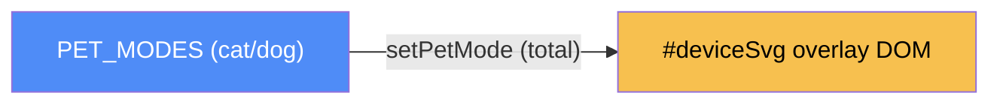

# Device panel — categorical model

> Model-first (FRAMEWORK §2/§4). Intended specification for this component; the
> code realises it (see IMPLEMENTATION.md). Source of record: `index.html`.

## 1. Overview
The "Meet NuzzlePal" Cat/Dog mode toggle: swaps an accessory graphic, the
ring-light color, and a caption on top of the real device photo
(`images/nuzzlepal-device.jpg`), via a thin transparent SVG overlay
(`#deviceSvg`) whose lens position was measured against that specific photo.

## 2. Why
A degenerate case (§7.1) worth modeling anyway because `#ringLight`'s
`cx`/`cy` are **not** deducible from generic layout — they're measured
constants tied to one specific photo. That coupling is exactly the kind of
fact this framework exists to surface instead of leaving as a magic number.

## 3. Core category

## 4. Morphism table
| Morphism | Signature | Partiality | Semantics |
| --- | --- | --- | --- |
| `setPetMode` | `mode:'cat'\|'dog' → DOM` | Total | swaps accessory (`#accCat`/`#accDog`), ring-light color, caption |

## 5. Functors
None — a single total function.

## 6. Composition rules
1. `constraint: #ringLight's cx/cy are measured against images/nuzzlepal-device.jpg's
   exact pixel dimensions (viewBox 0 0 640 815)` — replacing that photo without
   re-measuring breaks the overlay alignment. Not enforced in code; enforced
   only by this note and CLAUDE.md's "Image & video policy" section.

## 7. Atoms owned (FRAMEWORK §4)
**Trn** — `setPetMode`; realising code `index.html:<script>`.
**Loc/Trm** — none beyond the whole-system default.

## 8. Bridges to other components (ports)
None.

## 9. Coherence notes
No §4.5 law FAILing. Composition rule 1 is a **Note: exception** in the §6.6
sense — it's a real constraint the code doesn't enforce (no assertion checks
the photo's dimensions match the SVG `viewBox`), documented here specifically
so it isn't lost.
