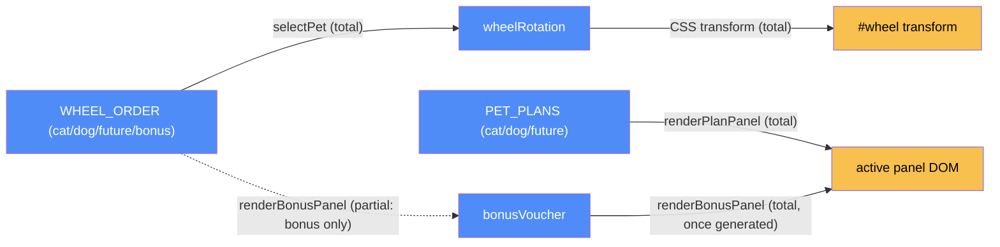

# Plans wheel — categorical model

> Model-first (FRAMEWORK §2/§4). Intended specification for this component; the
> code realises it (see IMPLEMENTATION.md). Source of record: `index.html`.

## 1. Overview
The spinnable Cats/Dogs/Future-Pets/Bonus plan picker: a CSS `conic-gradient`
wheel, click-to-spin and tab-to-select, plus a lazily-generated bonus voucher
for the fourth "Bonus" wedge, which deliberately has no plan behind it.

## 2. Why
The wheel's rotation math and the Bonus wedge's "legal wheel value with no
plan" design are exactly the kind of partiality FRAMEWORK asks to make
explicit rather than leave implicit in a `!== -1` check — see the morphism
table's `Partiality` column.

## 3. Core category

## 4. Morphism table
| Morphism | Signature | Partiality | Semantics |
| --- | --- | --- | --- |
| `selectPet` | `(petKey, extraTurns?) → wheelRotation × DOM` | Partial | valid iff `WHEEL_ORDER.indexOf(petKey) !== -1` — deliberately **not** a `PET_PLANS` lookup, so `bonus` is legal with no plan |
| `initWheel` | `() → DOM listener` | Total | converts click pixel position → compass angle via `Math.atan2`, generic over `WHEEL_ORDER.length` |
| `renderPlanPanel` | `petKey:'cat'\|'dog'\|'future' → DOM` | Partial | only for keys present in `PET_PLANS` |
| `renderBonusPanel` | `() → DOM × bonusVoucher` | Total | lazily creates `bonusVoucher` on first view, reused after |
| `renderActivePanel` | `petKey → DOM` | Total | dispatches to `renderPlanPanel` or `renderBonusPanel` |
| `updateTabsUI` | `petKey → DOM` | Total | |
| `generatePromoCode` | `() → string` | Total | excludes visually ambiguous chars (`0/O`, `1/I`) |
| `addOneMonth` | `date → date` | Total | uses `Date#setMonth` — correctly rolls over year/day-count edges; don't hardcode "30 days" |
| `formatDate` | `date → string` | Total | |

## 5. Functors
**Wheel-selection pipeline**: `click-or-tab-event → selectPet → (wheelRotation,
renderActivePanel) → DOM`. `wheelRotation` only ever increases (§6.1 below),
so this functor has a monotonic invariant, not just a state transition.

## 6. Composition rules
1. `invariant: wheelRotation always increases` — `selectPet` always rotates
   *forward* to the next multiple of 360 that lands the target wedge under the
   fixed pointer, so repeated selections never spin backwards.
2. `deduction: bonusVoucher.expires = addOneMonth(bonusVoucher.issued)` —
   computed once at generation, not re-derived per render.
3. `invariant: bonus ∈ WHEEL_ORDER but bonus ∉ PET_PLANS` — intentional
   partiality, not a missing-data bug; `selectPet`'s validity check reflects
   this directly.

## 7. Atoms owned (FRAMEWORK §4)
**Trn** — the morphism table above; realising code `index.html:<script>`.
**Loc** — one: the browser tab. Collapsed to one process (§7.1).
**Trm** — none.
**Placements (§4.2)** — none.

## 8. Bridges to other components (ports)
| Boundary morphism | Signature | Stored? | Semantics |
| --- | --- | --- | --- |
| `el`, `showToast` | `content → plans-wheel` | No | called directly, no declared port — see `docs/suggestions.md` #1 |

## 9. Coherence notes
No §4.5 law is FAILing. The `bonus`-has-no-plan partiality (composition rule 3)
is the one modeling decision worth re-reading before touching `selectPet` or
`renderActivePanel` — changing the validity check to a `PET_PLANS` lookup
would silently break the Bonus wedge.
