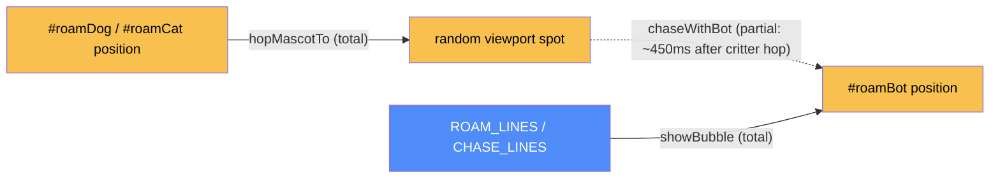

# Roaming mascots — categorical model

> Model-first (FRAMEWORK §2/§4). Intended specification for this component; the
> code realises it (see IMPLEMENTATION.md). Source of record: `index.html`.

## 1. Overview
Three `position:fixed` mascot buttons (`#roamBot`, `#roamDog`, `#roamCat`) that
hop to random viewport spots on click; clicking the dog or cat also makes the
robot "chase" it after a short delay. Pure UI easter egg, no plan/content data.

## 2. Why
Tiny component (§7.1-adjacent: no distinct `Dat` of its own beyond two line
arrays) — modeled separately anyway because it's a genuinely separate feature
seam per `CLAUDE.md`, and its viewport-only constraint (§6, composition rule 1)
is a real invariant worth stating once rather than re-discovering by reading
three call sites.

## 3. Core category

## 4. Morphism table
| Morphism | Signature | Partiality | Semantics |
| --- | --- | --- | --- |
| `randomViewportSpot` | `Element → {x,y}` | Total | 16px margin, sized off `offsetWidth` |
| `hopMascotTo` | `(Element, x, y) → DOM` | Total | sets inline `left`/`top`, replays `bot-hop` keyframe |
| `chaseWithBot` | `(spot, kind) → DOM` | Partial | fires ~450ms after a critter hop, offsets ~80px |
| `initRoamBot` | `() → DOM listener` | Total | |
| `initRoamCritter` | `(id, kind) → DOM listener` | Total | shared by dog and cat |
| `initMascotVisibility` | `() → DOM` | Total | |
| `showBubble` | `(bubble, text) → DOM` | Total | |

## 5. Functors
None — no pipeline beyond the click→hop→(delayed chase) sequence already
captured in the morphism table.

## 6. Composition rules
1. `invariant: all three mascots stay within the viewport, never the full
   scrollable document` — deliberate simplification (CLAUDE.md), enforced by
   `randomViewportSpot` reading `window` viewport bounds, not document bounds.

## 7. Atoms owned (FRAMEWORK §4)
**Trn** — the morphism table above; realising code `index.html:<script>`.
**Loc/Trm** — none beyond the whole-system default (one collapsed `Loc`, no `Trm`).

## 8. Bridges to other components (ports)
None beyond the shared `el`/`showToast` utility calls noted at system level.

## 9. Coherence notes
No §4.5 law FAILing. The species-legibility redesign history (CLAUDE.md: two
failed revisions before face-only icons worked) lives in code comments' spirit
only — if this component is touched again, read `CLAUDE.md`'s "Roaming
mascots" section first, not just this model.
